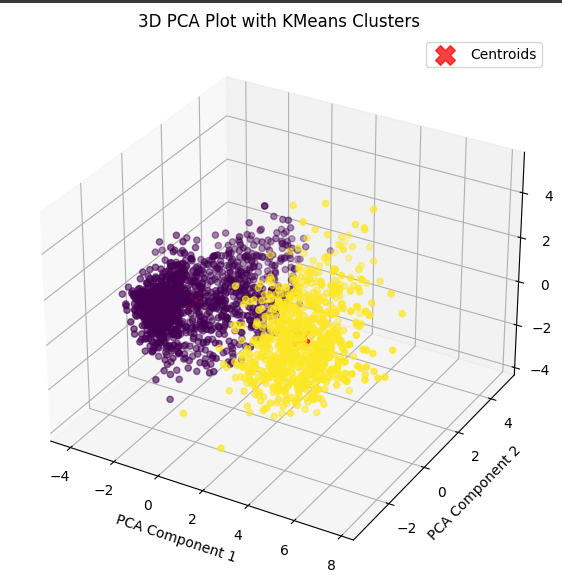
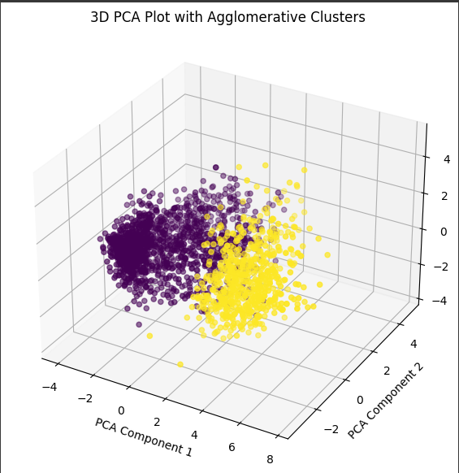
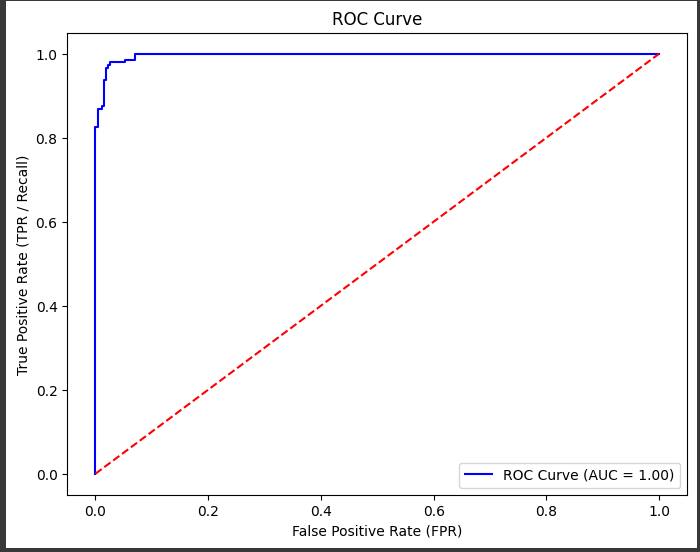
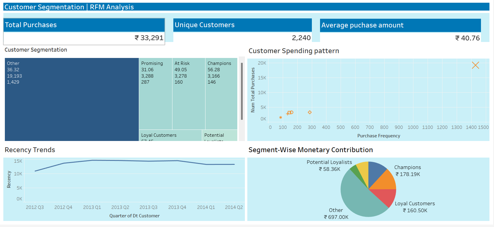

# customer-segmentation-project

**Project Overview**:  
This project aims to perform customer segmentation based on purchasing behavior using clustering algorithms (KMeans, Agglomerative Clustering, and DBSCAN). After identifying clusters, I applied classification algorithms like Random Forest and XGBoost to predict customer clusters.

**Key Results**:  
- Achieved 97% accuracy in predicting customer clusters using XGBoost.
- Performed feature scaling, hyperparameter tuning, and visualized insights.

**Technologies Used**:  
- Python (pandas, scikit-learn, XGBoost, Matplotlib)
- Jupyter Notebook
  

**Project Files**:
- `final_customersegmentation_maveric_project_updated_v2.ipynb`: Jupyter notebook with all the code and analysis.
- `data/`: Folder containing the dataset used for this analysis.
- `README.md`: Overview of the project.
## Cluster Visualizations

Here are the clusters generated by KMeans:

The following image shows the clusters formed using Agglomerative Clustering:

## ROC Curve for Model Performance

Below is the ROC curve for the XGBoost model used for classification:

The AUC score of the ROC curve is 1.00, indicating excellent model performance.

# Customer Segmentation and RFM Analysis Dashboard

- This project focuses on customer segmentation using RFM (Recency, Frequency, Monetary) analysis. By segmenting customers based on their purchasing behaviors, we can identify key customer groups and tailor business strategies accordingly. The project includes a Tableau dashboard that visualizes the RFM analysis and provides insights into customer segments.

## Demo
Check out the Tableau dashboard for customer segmentation:  
[Live Tableau Dashboard](https://public.tableau.com/views/Customer_Segmentation_RFM_analysis/CustomerSegmentation?:language=en-GB&publish=yes&:sid=&:redirect=auth&:display_count=n&:origin=viz_share_link)

## Features
- **Customer Segmentation**: Groups customers based on their RFM scores, showing the distribution of segments like Champions, At Risk, Promising, and others.
- **Recency Trends**: Line chart illustrating recency trends over time.
- **Customer Spending Patterns**: Scatter plot analyzing the number of purchases against purchase frequency.
- **Segment-Wise Monetary Contribution**: Pie chart representing how much each customer segment contributes to the overall revenue.

## Technologies Used
- **Data Visualization**: Tableau
- **Data Analysis**: RFM (Recency, Frequency, Monetary) framework
- **Tools**: Python,Tableau

